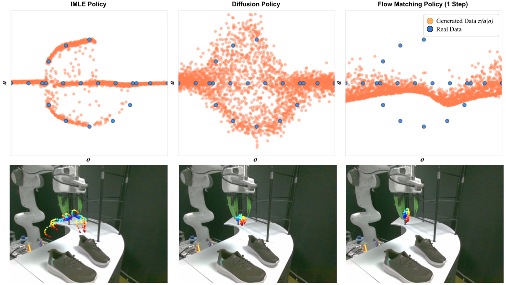

# IMLE Policy

[[Project page]](https://imle-policy.github.io/)
[[Paper]](https://www.roboticsproceedings.org/rss21/p158.pdf)
[[Data]](https://huggingface.co/datasets/krishanrana/imle_policy/resolve/main/datasets.zip)
[[Colab]](#)


[Krishan Rana](https://krishanrana.github.io/)<sup>†,1</sup>,
[Robert Lee](https://scholar.google.com.au/citations?user=1Vqlm0kAAAAJ&hl=en)<sup>†</sup>,
[David Pershouse](#)<sup>1</sup>,
[Niko Suenderhauf](https://nikosuenderhauf.github.io/)<sup>1</sup>,

<sup>†</sup>Equal Contribution,
<sup>1</sup>Queensland University of Technology,



## Installation

Download our source code:
```bash
git clone https://github.com/krishanrana/imle_policy.git
cd imle_policy
```

Create a virtual environment with Python 3.10 and activate it, e.g. with [`miniconda`](https://docs.anaconda.com/free/miniconda/index.html):
```bash
conda create -y -n imle_policy0 python=3.10 evdev=1.9.0 xorg-x11-proto-devel-cos6-x86_64 glew mesa-libgl-devel-cos6-x86_64 libglib
conda activate imle_policy
```

Install all requirements:
```bash
pip install -e .
```

Download Mujoco for the Kitchen and UR3 Block Push environments:
```bash
cd imle_policy
./get_mujoco.sh
```
Download all the required datasets and extract (~25GB):
```bash
wget https://huggingface.co/datasets/krishanrana/imle_policy/resolve/main/datasets.zip && unzip datasets.zip -d datasets && rm datasets.zip
```
To download and extract only the PushT sim dataset:
```bash
wget https://huggingface.co/datasets/krishanrana/imle_policy/resolve/main/pusht_dataset/datasets.zip && unzip datasets.zip -d datasets && rm datasets.zip
```

## Quick Start

To train IMLE Policy on the PushT task with all the default parameters, run:
```bash
python train.py --task pusht --method rs_imle 
```

Available options:

> **task:** pusht, Lift, NutAssemblySquare, PickPlaceCan, ToolHang, TwoArmTransport, kitchen, ur3_blockpush

> **method:** rs_imle, diffusion, flow_matching

> **dataset_percentage:** Fixed subsample of the full dataset ranging from 0.1 to 1.0

> **epsilon:** IMLE Policy-specific hyperparameter that controls the rejection sampling threshold

> **n_samples_per_condition:** IMLE Policy-specific hyperparameter that controls the number of samples per condition

> **use_traj_consistency:** IMLE Policy-specific hyperparameter that controls whether to use trajectory consistency or not


## Citation

If you found our code helpful please consider citing:

<pre><code>
  @inproceedings{rana2025imle, 
  title = {IMLE Policy: Fast and Sample Efficient Visuomotor Policy Learning via Implicit Maximum Likelihood Estimation}, 
  author = {Rana, Krishan and Lee, Robert and Pershouse, David and Suenderhauf, Niko}, 
  booktitle = {Proceedings of Robotics: Science and Systems (RSS)}, year = {2025}} 
</code></pre>

## Acknowledgement
The authors would like to thank the open source code upon which this project was built upon:
* The policy architectures, diffusion policy implementation and Push-T env are built off the [Diffusion Policy](https://github.com/real-stanford/diffusion_policy/tree/main) repository.
* The Lift, NutAssemblySquare, PickPlaceCan, ToolHang, and TwoArmTransport environments are provided by [Robomimic](https://github.com/ARISE-Initiative/robomimic).
* The Kitchen environment is provided by [D4RL](https://github.com/Farama-Foundation/D4RL/tree/master/d4rl/kitchen).
* The UR3 Block Push environment is adapted from the [VQ-BeT](https://github.com/jayLEE0301/vq_bet_official) repository.
  
